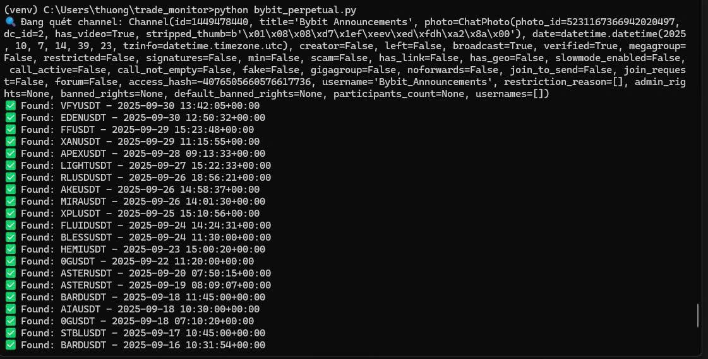
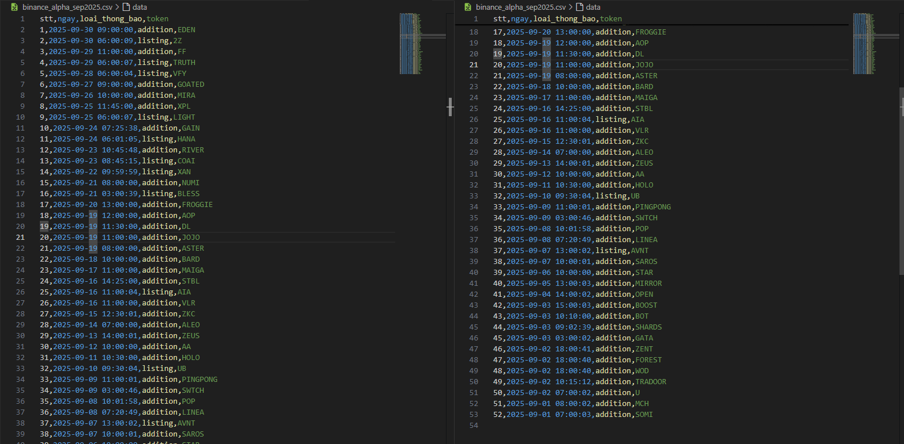

Bước 1: Đăng nhập Telegram 
python qr_login.py
Bước 2: Chạy Scraper
python binance_alpha_scraper.py
Project Structure
TRADE_MONITOR/
├── 📁 config/
│   └── telegram_alpha_scraper.json    # Configuration file
├── 📁 venv/                          # Virtual environment
├── 🔐 alpha_session.session           # Telegram session
├── 🐍 binance_alpha_scraper.py        # Main scraper script
├── 📊 binance_alpha_sep2025.csv       # Output data
├── 📱 qr_login.py                    # QR login script
├── 📋 requirements.txt               # Dependencies
└── 📖 README.md                      # This file

Technical Stack
Python 3.8+ - Ngôn ngữ lập trình chính

Telethon - Telegram API client

Asyncio - Xử lý bất đồng bộ

QR Code - Đăng nhập bảo mật

CSV - Xuất dữ liệu
## 🎯 ket qua

### CSV
